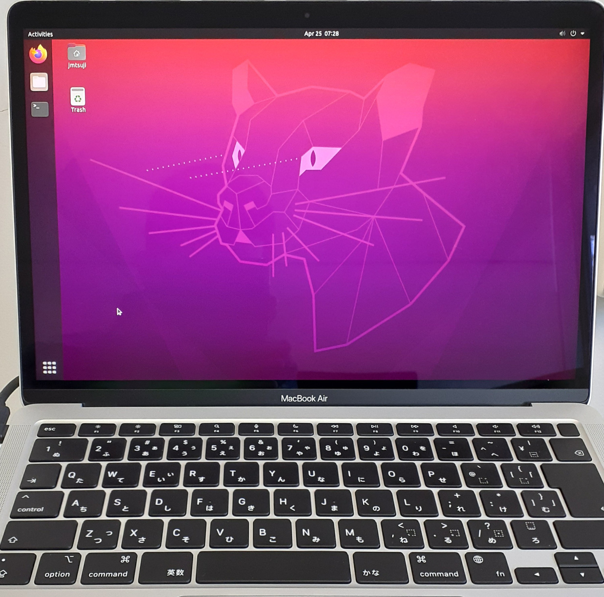

# Bioinformatics on M1
Personal notes about migration to n M1 Mac as a bioinformatics user

## Background
Apple recently released the M1 processor chip. Fewer and fewer Macs are being sold that use Intel processors. So, it is straightforward to do bioinformatics tasks on a M1 Mac? Here, I record my (rough) personal notes using a M1 Mac for bioinformatics.

## Architecture differences
The M1 chip is based on ARM architecture (like used in cell phones and the Raspberry Pi), unlike the x86 architecture used on Intel chips. This architecture difference has implications on what code can run on the M1. Apple released the [Rosetta 2 tool](https://support.apple.com/ja-jp/HT211861) to automatically translate code written for x86 ARM-compatible code when a program is first run, but Rosetta 2 does not always work. As one major example, Skype Desktop currently (April 2022) does not run on Macs with a M1 chip (based on [this link](https://www.macworld.co.uk/news/which-apps-work-on-m1-macs-3798238)). Many companies are working on writing M1-optimized versions of their software. However, I imagine that M1-optimized versions of bioinformatics tools will probably not be made available in many cases.

## My experiences
Important bioinformatics-related software for me that works on M1:
- Microsoft Office
- Microsoft OneDrive (M1-optimized version must be downloaded directly from the Microsoft website as of March 2022)
- PyCharm Community Edition (for writing Python code)

Important software for me that does not work out-of-the-box on M1:
- Many conda installations (e.g., BLAST)
- Inkscape (extremely slow; nearly unusuable)
- GIMP (kind of works, but sometimes crashes)
- Skype Desktop (I did not try to install this personally but saw reports that it does not work)

## Workarounds for important software
I've found reasonable workarounds for all 4 software tools mentioned above that do not work for me out-of-the-box:

### 1. Conda installs
Instead of using miniconda, you can use miniforge ([link here](https://github.com/conda-forge/miniforge)) and force it to install packages that have x86 compatibility (rather than ARM). I think Rosetta then recompiles the code for you. See details at [this link](https://github.com/Haydnspass/miniforge#rosetta-on-mac-with-apple-silicon-hardware). Using miniforge seems to allow most (or all?) of the packages I have tested so far to work -- e.g., BLAST, Jupyter lab, and so on. Thanks to this article ([link here](https://towardsdatascience.com/using-conda-on-an-m1-mac-b2df5608a141)) for the suggestion to use miniforge.

### 2. Inkscape
Install UTM (a virtual machine manager) and create a virtual machine of Ubuntu 20.04 ARM on your Mac (see guide at [this link](https://mac.getutm.app/gallery/ubuntu-20-04)). You can make a shared folder that lets you easily move files between the two systems. You can also set up copy-and-paste of text between macOS and the Ubuntu virtual machine. Inkscape can be installed inside the Ubuntu Virtual Machine, and it works smoothly.

Inkscape can be installed and launched from a Ubuntu VM runnning on a M1 Mac.

### 3. GIMP
Same solution as #2. I have not extensively tested GIMP yet, but it seems to work well for very basic tasks.

### 4. Skype Desktop
Use the web browser version of Skype at https://web.skype.com/ -- works very smoothly.

## Tips/reflections
If possible, I recommend buying a Mac with 16GB of memory (rather than the default 8 GB for Macbook Air's at the moment). This lets you run a virtual machine without much worry of using too much RAM.

So far, I have been happy with my M1 Mac. Most software I need can be run with appropriate workarounds. I still do my major bioinformatics tasks on a Linux server, and minor bioinformatics tasks seem to run okay. The most annoying workaround currently is the need to use a virtual machine to run Inkscape.

## Final remarks
For now, I have only written brief notes about my experiences. If you are interested in learning more about the workarounds I mentioned above, or if you have found other (and simpler) ways to do bioinformatics that what I have mentioned, please open a GitHub Issue in this repo and let me know. Thanks!

